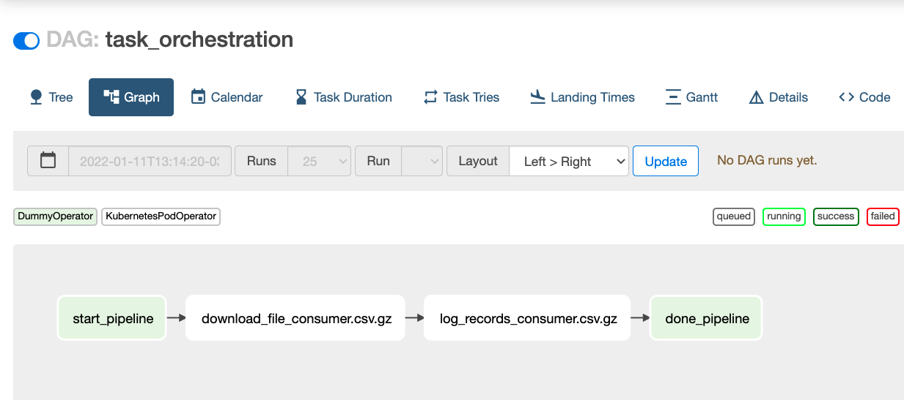

# Task Orchestration Platform
This project aims to create a easy-to-run platform build upon some technoliges as:
- [Kubernetes](https://kubernetes.io/pt-br/)
- [Kind](https://kind.sigs.k8s.io/)
- [Airflow](https://airflow.apache.org/)

## Objective
Create a platform which will provision a Kubernetes cluster using Kind and Airflow with a DAG to download file and print records.

## Getting started

### Requirements

At first we need some requirements to build our task orchestration platform.

- docker
- kind installed
- kubectl configured
- helm
- AWS Credentials with access to an s3 bucket with following policy:
    ```json
    {
        "Id": "Policy1",
        "Version": "2012-10-17",
        "Statement": [
            {
                "Sid": "Statement1",
                "Action": [
                    "s3:GetObject",
                    "s3:ListBucket",
                    "s3:PutObject"
                ],
                "Effect": "Allow",
                "Resource": [
                    "arn:aws:s3:::<S3_BUCKET_NAME>",
                    "arn:aws:s3:::<S3_BUCKET_NAME>/*"
                ]
            }
        ]
    }
    ```
    You have to replace `S3_BUCKET_NAME` with your bucket name.

You have to fill some envs in `Makefile`:
- `CLUSTER_NAME`
- `DOCKER_IMAGE_NAME`
- `AWS_ACCESS_KEY`
- `AWS_SECRET_ACCESS_KEY_ID`

After this requirements are completed you have to configure your dag.

This platform uses a self-service engine which configure your dag based on a Yaml config file.
This DAG have two tasks which are:
- `download_file`
    - This task will download a file based on URI, write file to a /tmp folder and upload to s3 bucket that you have configured early
- `log_records`
    - This task will download previous file from s3 bucket to a pandas Dataframe using `awswrangler`, parse Dataframe to json and print each json line.

### Yaml config
The yaml config file are located on `dags/configs` and has the following schema:
```yaml
dag_name: string
schedule_interval: string
owner_email:
  - array(string)
owner_name: string
depends_on_past: boolean
is_paused_upon_creation: boolean
files:
  - file_name: string
    file_uri: string
    s3_output_bucket: string
    compression_type: string
```

The dag generator will create each dag for config file based on values.

### Running

Config file for the challenge dag:
```yaml
dag_name: task_orchestration
schedule_interval: '@daily'
owner_email:
  - teste@test.com
owner_name: test
depends_on_past: false 
is_paused_upon_creation: false
files:
  - file_name: consumer.csv.gz
    file_uri: https://ifood-data-architect-test-source.s3-sa-east-1.amazonaws.com/consumer.csv.gz
    s3_output_bucket: s3://task-orchestration-platform
    compression_type: gzip
```

After all these requirements, only thin you have to do is run:
```bash
make up
```

This command will provision all components required to run the platform, which are:
- Kind K8s Cluster
- Docker image registry running in docker
- Airflow 2.0
- A DAG with previous config file

At the end of command `make up` a proxy will be created to access airflow from browser in [http://localhost:8080](http://localhost:8080)



| This project use `KubernetesExecutor` and `KuebernetesPodOperator`

To destroy the environment simply run:
```bash
make down
```

## Tests
There are some tests to validate scripts in `scripts` folder. Please run:
```bash
make test
```

To access coverage report, please open the file located at: `htmlcov/index.html`

## References
- [Airflow On Kubernetes in 10 mins - Marc Lamberti](https://marclamberti.com/blog/airflow-on-kubernetes-get-started-in-10-mins)